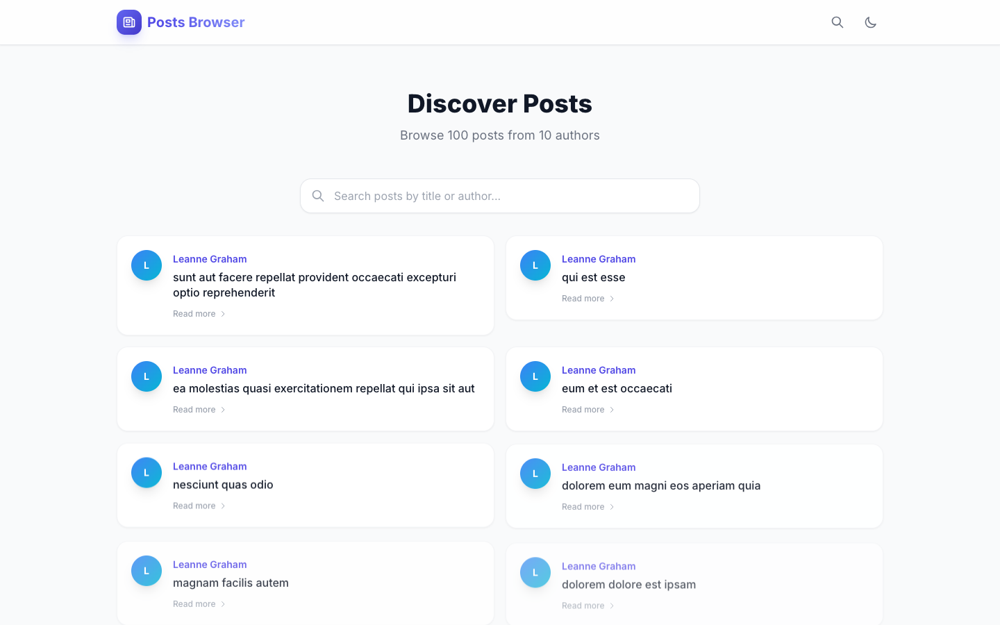
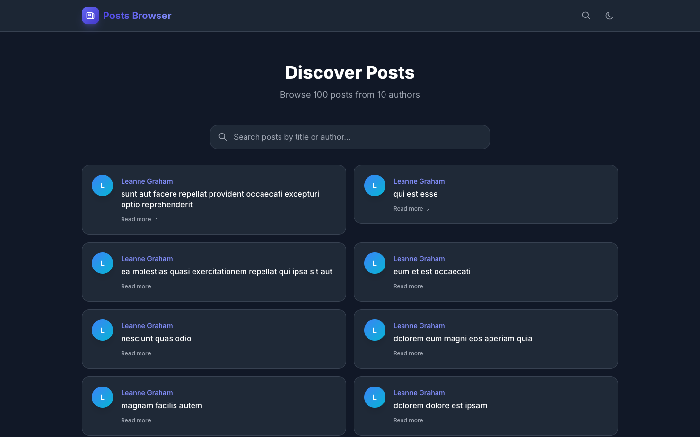
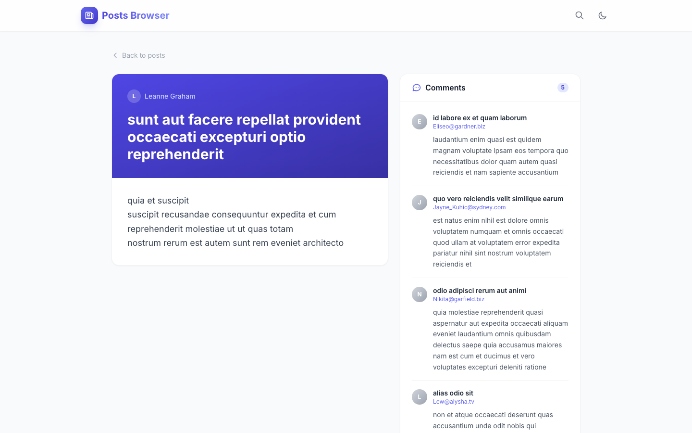
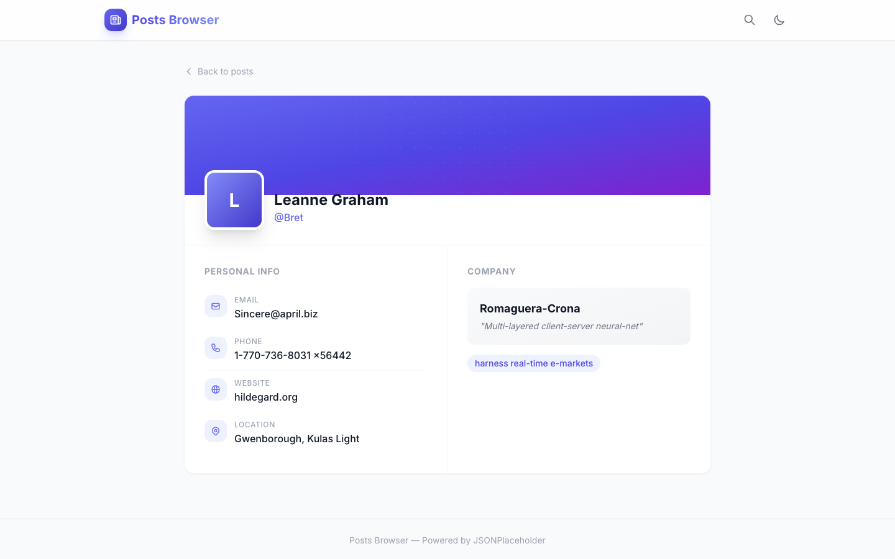
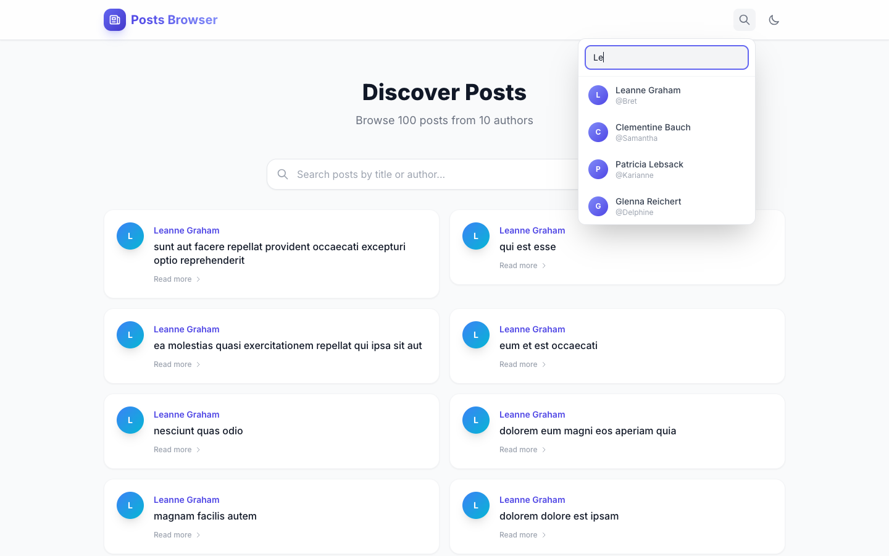

# Posts Browser

A modern, beautifully designed React application for browsing posts, users, and comments. Powered by the [JSONPlaceholder](https://jsonplaceholder.typicode.com/) API.

## Screenshots

### Home Page (Light Mode)


### Home Page (Dark Mode)


### Post Detail Page


### User Profile Page


### User Search


## Features

- **Modern UI** — Card-based layout with gradient accents, smooth animations, and glassmorphism header
- **Dark Mode** — Toggle between light and dark themes, persisted in localStorage
- **Search & Filter** — Full-text search across post titles and author names
- **User Search** — Instant dropdown search for users from the header
- **Pagination** — Browse posts 10 at a time with numbered page navigation
- **Post Detail View** — Split layout showing post content alongside a scrollable comments panel
- **User Profiles** — Rich profile cards with personal info, company details, and contact links
- **Loading Skeletons** — Animated skeleton placeholders while data is being fetched
- **Error Handling** — Graceful error states with user-friendly messages
- **Responsive Design** — Fully responsive grid that adapts from mobile to desktop
- **Staggered Animations** — Post cards animate in with staggered slide-up effects

## Tech Stack

- **React 17** + React Router 6
- **Tailwind CSS 3** — utility-first styling with custom animations and dark mode
- **Create React App** — build tooling
- **JSONPlaceholder API** — mock REST API for posts, users, and comments

## Quick Start

```bash
npm install
npm start
# http://localhost:3000
```

## Routes

| Path | Page |
|------|------|
| `/` | Home — paginated post grid with search |
| `/post/:postId` | Post detail with comments sidebar |
| `/user/:userId` | User profile card |

## Project Structure

```
src/
├── App.js               # Router setup + dark mode state
├── container/           # Page-level containers (HomePage, PostPage, UserPage)
├── component/           # Reusable components (Post, PostDetails, DisplayPosts, User)
├── Header/              # Sticky header with search dropdown + dark mode toggle
├── context/             # React context for global data (posts, users)
├── helpers/             # API fetch utilities with error handling
└── HOC/                 # Higher-order components (withLoadingScreen)
```

## Build

```bash
npm run build
```
